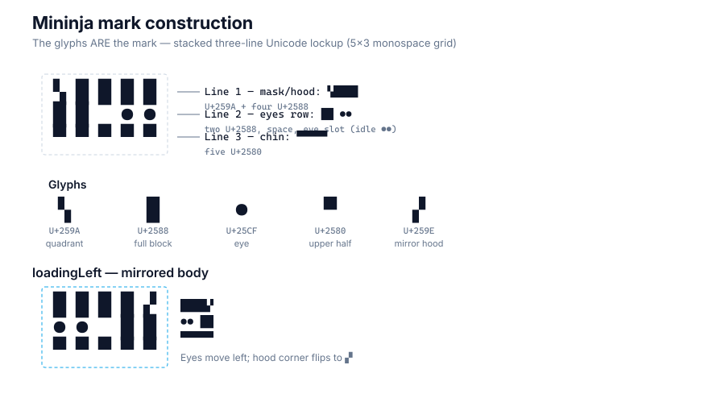
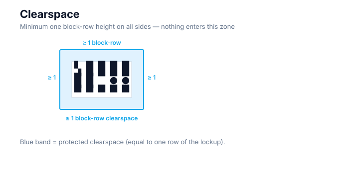
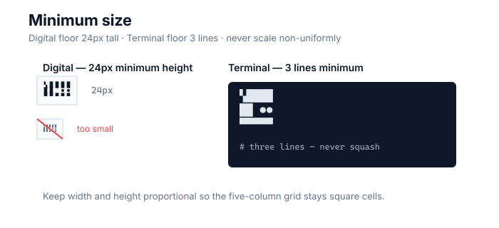
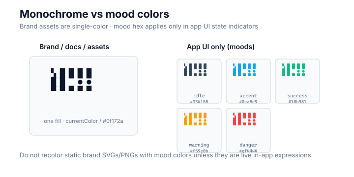
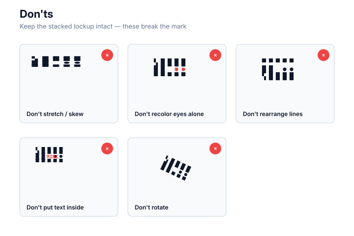

# Mininja Brand Rules

Rules for reproducing and placing the Mininja mark. The mascot has no name. See [STYLEGUIDE.md](STYLEGUIDE.md) for expression states and mood colors in app UI.

## The stacked mark

The mark **is** this three-line Unicode lockup on a monospace grid (glyphs are the mark):

```
▚████
██ ●●
▀▀▀▀▀
```

- Line 1 (mask/hood): `▚████` — U+259A + four U+2588
- Line 2 (eyes row): `██ ●●` — two U+2588, space, two-character eye slot (idle: U+25CF U+25CF)
- Line 3 (chin): `▀▀▀▀▀` — five U+2580

`loadingLeft` mirrors the body:

```
████▞
●● ██
▀▀▀▀▀
```

Full character-by-character breakdown: [CONSTRUCTION.md](CONSTRUCTION.md). Expression eyes: [STYLEGUIDE.md](STYLEGUIDE.md).




## Clearspace



Keep a minimum clearspace equal to **one block-row height** on all sides of the lockup. No other marks, text, or imagery may enter this zone.

## Minimum sizes



- **Digital:** 24px minimum height (full three-line lockup).
- **Terminal:** minimum 3 lines tall (one row per line of the lockup). Never scale non-uniformly — width and height must stay proportional so the five-column grid remains square cells.

## Monochrome rule



The mark itself is **single-color** (monochrome). Use one fill color — typically `currentColor`, black, or a dark slate such as `#0f172a` — so the lockup works on light and dark backgrounds.

The five mood hex values in [`kit/mark.json`](kit/mark.json) → `moodColorsUiOnly` (`idle`, `accent`, `ok`, `warn`, `err`) — narrated in STYLEGUIDE — apply **only in app UI contexts** where the mascot is rendered as a live state indicator. They do not recolor brand assets, documentation lockups, or static exports unless those assets are explicitly part of an in-app expression UI.

## Backgrounds

Place the mark on a **solid dark or solid light** background only. Do not place it over busy imagery, gradients that obscure the glyphs, photographs, or patterned surfaces that compete with the block geometry.

## Don'ts



- Don't stretch or skew the lockup.
- Don't recolor the eyes independently of the mood system (in app UI, eyes and body share the mood color; in brand assets, keep the whole mark monochrome).
- Don't rearrange the three lines or swap glyphs outside the STYLEGUIDE expression table.
- Don't put text inside the lockup.
- Don't rotate the mark.

## Glanceable presence (voice)

When the mark is a living **pal** on the desk, brand voice prefers **posture over prose**: face / stage / plant silhouette carry the glance; optional text is chrome. Default warm quiet. Do not market Mininja as a notification inbox or KPI dashboard. See [GLANCE.md](GLANCE.md) · [BRAND.md](BRAND.md).

The pal remains **unnamed** (never Casque; no he/him). Multi-pal color, if used, is host chrome — not a second mark catalog in kit.

## Terminal scenery and motion

When the mark appears as a living buddy in a terminal or console banner, follow [SCENERY.md](SCENERY.md) (stages, weather, props) and [TERMINAL-MOTION.md](TERMINAL-MOTION.md) (walk, patrol, facing, reduced motion). Those rules are part of the brand, not product-only details.

