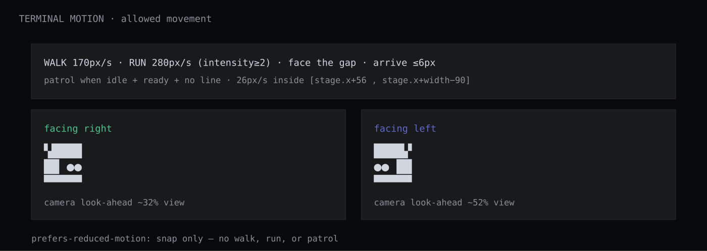

# Mininja Design Mark


Canonical record of the Mininja ASCII mascot design. This repository exists as a timestamped public record of the mark and its use in commerce.


## The mark


      ▚████
      ██ ●●
      ▀▀▀▀▀


A ninja face rendered in Unicode block-drawing characters (U+259A, U+2588, U+25CF, U+2580). The mascot has no name.


## First use in commerce


The mark has been in continuous use as the Mininja brand identifier since July 2026, including:


- The russfranky-bot/mininja-cli repository README (repository created 2026-07-19), where the mark appears as the terminal banner lockup.
- examples/banner/banner.sh in the same repository, which prints the mark in the user's terminal.


## Record


This repository was created to preserve a public, timestamped record of the design above. Git history provides the timestamps.


## Official mascot


The Mininja mark above is the official mascot of Thingscorp LLC.


## Example use case


https://github.com/user-attachments/assets/76965444-03ec-45f8-9dd7-a37f9d35fb0f


The mark in use as a terminal-based ninja pet. The mascot's eyes change with its mood and state — focused, content, eating ("nom nom"), dirty ("needs a wash"), and clean ("squeaky clean") — while the app tracks health, hunger, energy, joy, and hygiene stats with feed, play, train, clean, sleep, and heal commands.


## Brand documentation

| Doc | Description |
|-----|-------------|
| [STYLEGUIDE.md](STYLEGUIDE.md) | Expression states, moods, construction rules |
| [CONSTRUCTION.md](CONSTRUCTION.md) | Character-by-character stacked Unicode lockup |
| [BRAND-RULES.md](BRAND-RULES.md) | Clearspace, sizes, monochrome, backgrounds, don'ts |
| [TRADEMARK.md](TRADEMARK.md) | Ownership, first use, ™ guidance (no registration filed) |
| [SCENERY.md](SCENERY.md) | Terminal stage strip, weather, props |
| [TERMINAL-MOTION.md](TERMINAL-MOTION.md) | How the mark may walk / patrol in console |
| [CHANGELOG.md](CHANGELOG.md) | Mark version history |
| [kit/](kit/) | Machine SoT — mark + scene JSON |
| [PORTING.md](PORTING.md) | Presence ladder + how to port |
| [adapters/](adapters/) | Thin mark / ANSI / React sketches |
| [examples/](examples/) | CLI banner + README badge |
| [assets/](assets/) | Monochrome SVG/PNG for all 15 states |
| [assets/visuals/](assets/visuals/) | Visual guides (construction, clearspace, sizes, sheet, don'ts) |

## Visual overview

The mark is a **stacked three-line Unicode lockup** (glyphs are the mark):

```
▚████
██ ●●
▀▀▀▀▀
```


## Terminal scenery





