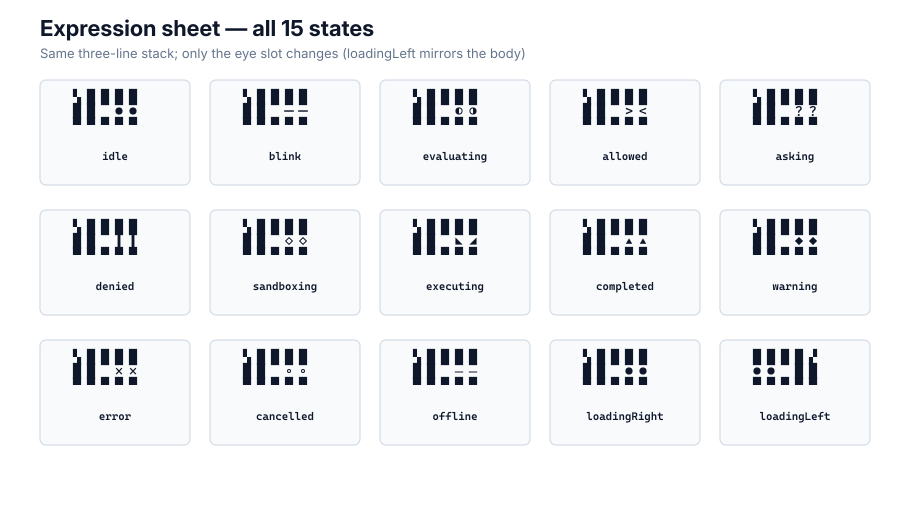

# Mininja

```
▚████
██ ●●
▀▀▀▀▀
```

## Why people love Mininja

It is a **port-first Unicode helper**: three lines of block characters you can paste into a README or run from a shell in under a minute. The **mark is the product** — not a logo file beside an app, not a redrawn mascot card. Progressive presence lets you ship the idle lockup first, then faces, a scoot, or a full terminal scene only when you want them. The mascot is a warm helper and **unnamed** (never give it a personal name; never misspell the brand as “minija”). The repo stays **Unix-small**: [`kit/`](kit/) is data, [`adapters/`](adapters/) are filters, [`console/`](console/) and [`bot/`](bot/) are optional.

Owned by [Thingscorp LLC](https://github.com/Thingscorp). The glyphs *are* the mark.

---

## Start in 60 seconds

```bash
git clone https://github.com/Thingscorp/mininja.git
cd mininja
./examples/cli-banner.sh          # idle lockup in your terminal
./examples/cli-banner.sh allowed  # another face
```

Or paste the idle mark into any README (see [`examples/readme-badge.md`](examples/readme-badge.md)).

Machine source of truth: [`kit/mark.json`](kit/mark.json) · [`kit/scene.json`](kit/scene.json).

---

## Presence ladder

Use the **thinnest** layer that fits:

| Level | What you ship | Start here |
|------:|---------------|------------|
| **1** | Idle 3-line lockup | [`examples/`](examples/), [`kit/mark.json`](kit/mark.json) |
| **2** | Faces / moods | [`adapters/mark`](adapters/mark), [`adapters/ansi`](adapters/ansi), [`assets/`](assets/) |
| **3** | Facing + scoot | [`adapters/react`](adapters/react), [`PORTING.md`](PORTING.md) |
| **4** | Full scene strip | [`console/`](console/) (optional) |

Invitation and invariants: **[`PORTING.md`](PORTING.md)**.


## Modules (Unix)

| Module | Does one job |
|--------|----------------|
| [`kit/`](kit/) | Hold glyphs + numbers (SoT). Nothing else. |
| [`adapters/*`](adapters/) | Tiny filters: strings · ANSI · React. No app deps. |
| [`examples/`](examples/) | Compose adapters. No business logic. |
| [`console/`](console/) | One program: terminal buddy (aligns to kit). |
| [`bot/`](bot/) | One program: Mac launcher + teammates — calls or documents `../console`, never vendors a second UI tree. |

Docs at the root narrate. Numbers never fork away from `kit/`.

---

## What's in this repo

| Path | Role |
|------|------|
| [`kit/`](kit/) | Machine SoT — mark + scene JSON |
| [`adapters/`](adapters/) | Thin mark / ANSI / React sketches |
| [`examples/`](examples/) | Copy-paste banner + README badge |
| [`assets/`](assets/) | Monochrome SVG/PNG for every face |
| [`console/`](console/) | Optional web terminal buddy |
| [`bot/`](bot/) | Optional Mac launcher + teammates |

Brand law stays at the root: [`STYLEGUIDE.md`](STYLEGUIDE.md) · [`CONSTRUCTION.md`](CONSTRUCTION.md) · [`BRAND-RULES.md`](BRAND-RULES.md) · [`TRADEMARK.md`](TRADEMARK.md) · [`SCENERY.md`](SCENERY.md) · [`TERMINAL-MOTION.md`](TERMINAL-MOTION.md).

---

## The mark

```
▚████
██ ●●
▀▀▀▀▀
```

A ninja face in Unicode block characters (U+259A, U+2588, U+25CF, U+2580). Five columns × three rows. No redrawn “premium” substitute — the stack *is* the mark.



## First use in commerce

Continuous use as the Mininja brand identifier since July 2026, including:

- The russfranky-bot/mininja-cli repository README (repository created 2026-07-19), where the mark appears as the terminal banner lockup.
- `examples/banner/banner.sh` in that repository, which prints the mark in the user's terminal.

See [`TRADEMARK.md`](TRADEMARK.md).

## Example in the wild

https://github.com/user-attachments/assets/76965444-03ec-45f8-9dd7-a37f9d35fb0f

Terminal pet: eyes track mood and state while the app tracks health, hunger, energy, joy, and hygiene.

---

## Optional deeper layers

**Console** — browser terminal buddy with programs → cards, scenery strip, plugins.

```bash
cd console && npm install && npm run dev
```

**Bot** — Mac menu-bar-adjacent launcher; teammates on local / remote / Codex. Points at this repo's console for the web surface; does not ship a second React tree.

```bash
cd bot && ./mininja
```

Details: [`console/README.md`](console/README.md) · [`bot/README.md`](bot/README.md).

---

## License

Mark and brand docs: see [`TRADEMARK.md`](TRADEMARK.md). Code under `adapters/`, `examples/`, `console/`, and `bot/` is MIT — [`LICENSE`](LICENSE).
