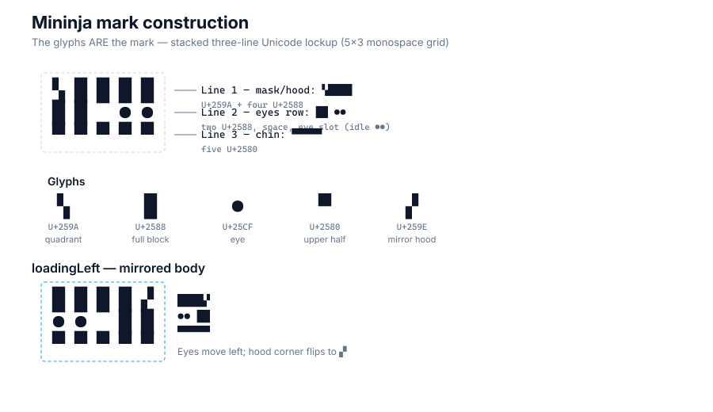
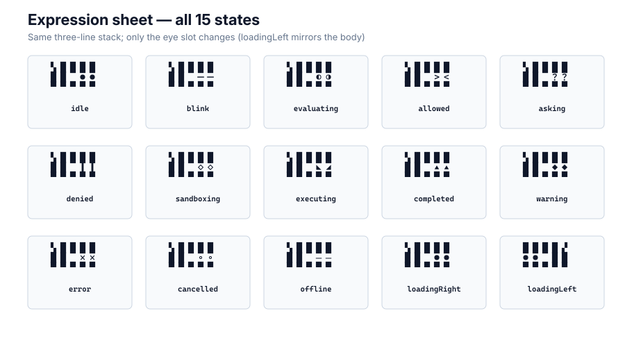
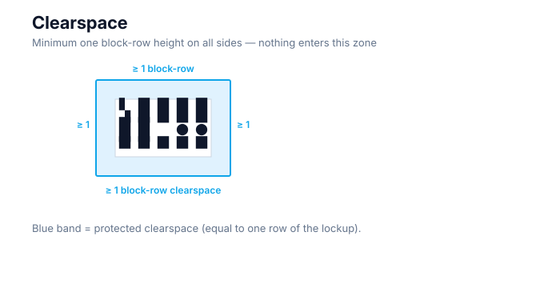
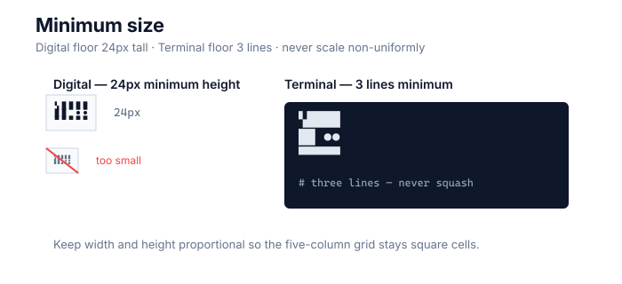
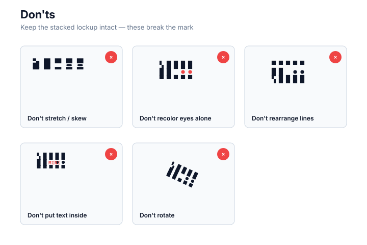
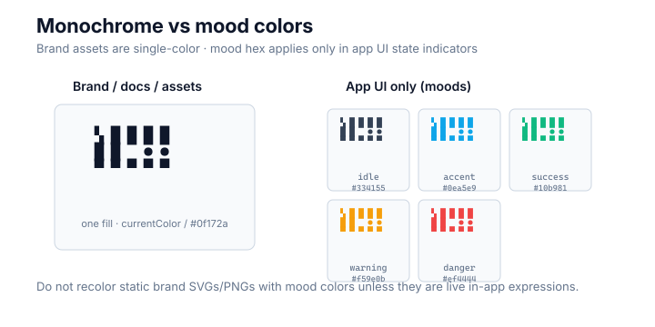
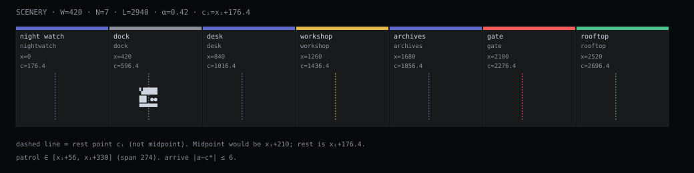
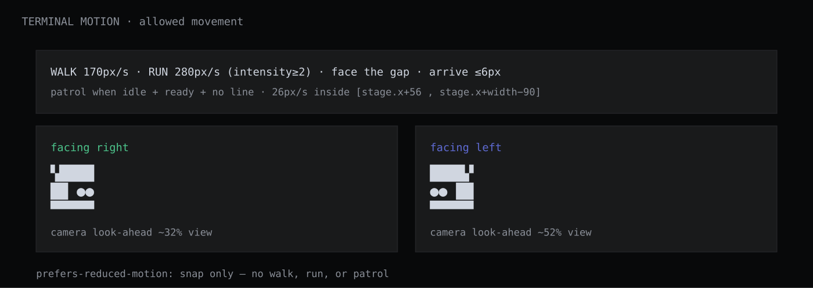

# mininja

[](LICENSE)

The **canonical design lockup and first-use record for the Mininja ASCII mascot** — the stacked three-line Unicode block mark, owned by Thingscorp LLC. This repo is a timestamped public record of the mark, its 15 expression states, its brand rules, and machine-readable source-of-truth files for porting it anywhere.

## Quickstart

```bash
git clone https://github.com/Thingscorp/mininja.git
cd mininja
bash examples/cli-banner.sh idle   # requires Node — prints the idle mark
```

## Install

Nothing to install — this is a brand-asset repo, not software. There is no package, no build step, and no dependencies: clone the repo and use the files directly, or copy individual SVG/PNG assets from `assets/` into your project.

## Usage

### The canonical lockup

The mark **is** this three-line Unicode lockup on a monospace grid — the glyphs are the mark:

```
▚████
██ ●●
▀▀▀▀▀
```

Line 1 (hood): `▚████` — U+259A + four U+2588. Line 2 (eyes row): `██ ●●` — two U+2588, a space, and the two-character eye slot (idle: U+25CF U+25CF). Line 3 (chin): `▀▀▀▀▀` — five U+2580. Full breakdown: [CONSTRUCTION.md](CONSTRUCTION.md).



### Expression states

15 expression states live in [`assets/`](assets/) — each has a monochrome `.svg` and a `.png` (512×512, transparent), fill `#0f172a`. The `loadingLeft` state mirrors the body (`████▞ / ●● ██ / ▀▀▀▀▀`).

| State | File stem | Eyes |
|-------|-----------|------|
| idle | `mininja-idle` | ●● |
| blink | `mininja-blink` | ── |
| evaluating | `mininja-evaluating` | ◐◑ |
| allowed | `mininja-allowed` | >< |
| asking | `mininja-asking` | ?? |
| denied | `mininja-denied` | ┃┃ |
| sandboxing | `mininja-sandboxing` | ◇◇ |
| executing | `mininja-executing` | ◣◢ |
| completed | `mininja-completed` | ▴▴ |
| warning | `mininja-warning` | ◆◆ |
| error | `mininja-error` | ×× |
| cancelled | `mininja-cancelled` | ◦◦ |
| offline | `mininja-offline` | ‒‒ |
| loadingRight | `mininja-loadingRight` | ●● |
| loadingLeft | `mininja-loadingLeft` | ●● + mirrored body |



For a README badge without any image, paste the idle lockup as a monospace code block (see [`examples/readme-badge.md`](examples/readme-badge.md)), or link `assets/mininja-idle.png` with alt text **Mininja mark**.

### Machine kit and adapters

- [`kit/mark.json`](kit/mark.json) — the machine source of truth: glyph grid, all 15 faces, clearspace, and minimum-size rules. Edit JSON here first; the markdown docs narrate the same numbers.
- [`kit/scene.json`](kit/scene.json) — stages, props, motion constants, emotions, and actions for the terminal-buddy layer.
- [`adapters/mark/lockup.mjs`](adapters/mark/lockup.mjs) — pure functions `listFaces()`, `linesFor(face, facing)`, `lockup(face, facing)`, `asPre(face, facing)`.
- [`adapters/ansi/render.mjs`](adapters/ansi/render.mjs) — `ansiLockup(face, { color, facing })` for terminals (tone colors are UI chrome only; mark geometry always comes from `kit/mark.json`).
- [`adapters/react/Mininja.tsx`](adapters/react/Mininja.tsx) — sketch `<Mininja face facing lines />` component (copy into your app; it keeps `aria-label="Mininja mark"`).

How to port the mark to a new surface without breaking brand rules: follow the presence ladder (mark-only → faces → scoot/facing → full scene strip) in [PORTING.md](PORTING.md).

### Brand rules and attribution

- The Mininja mark is owned by **Thingscorp LLC** and is the official mascot of Thingscorp LLC. The mascot **has no name** — use alt text / aria-label "Mininja mark", never a character name.
- You may use the ™ symbol to indicate the common-law claim (e.g. `Mininja™`). Do **not** use ® — **no trademark registration or pending application has been filed** ([TRADEMARK.md](TRADEMARK.md)).
- Keep the mark **monochrome** (`#0f172a` / `currentColor` / black) in brand assets and static exports. The five mood hex values apply only in app UI where the mascot is a live state indicator.
- Minimum clearspace: **one block-row height** on all sides. Minimum size: **24px** digital, **3 lines** terminal. Solid dark or solid light backgrounds only — never over busy imagery.
- Don't stretch, skew, rotate, or rearrange the three lines; don't recolor the eyes outside the mood system; don't put text inside the lockup ([BRAND-RULES.md](BRAND-RULES.md)).

### Brand documentation

| Doc | Covers |
|-----|--------|
| [STYLEGUIDE.md](STYLEGUIDE.md) | Expression states, moods, construction rules |
| [CONSTRUCTION.md](CONSTRUCTION.md) | Character-by-character stacked Unicode lockup |
| [BRAND-RULES.md](BRAND-RULES.md) | Clearspace, sizes, monochrome, backgrounds, don'ts |
| [TRADEMARK.md](TRADEMARK.md) | Ownership, first use in commerce, ™ guidance (no registration filed) |
| [SCENERY.md](SCENERY.md) | Terminal stage strip, weather, props |
| [TERMINAL-MOTION.md](TERMINAL-MOTION.md) | How the mark may walk / patrol in console |
| [CHANGELOG.md](CHANGELOG.md) | Mark version history |
| [PORTING.md](PORTING.md) | Presence ladder + how to port |
| [kit/](kit/) | Machine source of truth (mark + scene JSON) |
| [adapters/](adapters/) | Thin mark / ANSI / React sketches |
| [examples/](examples/) | CLI banner + README badge |
| [assets/](assets/) | Monochrome SVG/PNG for all 15 states |
| [assets/visuals/](assets/visuals/) | Visual guides (construction, clearspace, sizes, sheet, don'ts) |









### Terminal scenery

When the mark appears as a living buddy in a terminal, follow [SCENERY.md](SCENERY.md) and [TERMINAL-MOTION.md](TERMINAL-MOTION.md) — they are part of the brand, not product-only details.





## Contributing

See [CONTRIBUTING.md](CONTRIBUTING.md).

## License

MIT. See [LICENSE](LICENSE).
