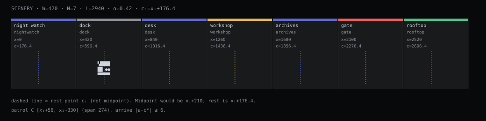

# Scenery

Canonical terminal world for the Mininja mark — the **habitat glass** inside the **terrarium for Devs**. Glass box on the desk = console / bot surface; creature = Unicode mark (unnamed); habitat glass = stages, props, and **scene weather** as scenery chrome from kit. Machine source of truth: [`kit/scene.json`](kit/scene.json). Console `src/lib/scene.ts` is a historical source and must stay aligned to kit — it is not live SoT. The mascot has no name.

This document is the **formal geometry** of the strip. Motion laws live in [TERMINAL-MOTION.md](TERMINAL-MOTION.md).

## Legos: stages and props snap

**Russ's law (short):** scenery is Lego — stages, props, scene weather, motion live in [`kit/scene.json`](kit/scene.json), snap via kit + adapters, fork the data to remix, don't rewrite console. Brand is Mininja; mascot unnamed, no he/him.

Stages, props, and scene weather are **rules you may modify**.

- Snap in a new stage, drop a prop, change scene weather — in a **kit fork** or a **local scene overlay** applied after load.
- Forking is encouraged. Publish your overlay or forked `stages` so others can reuse the piece.
- Upstream constants in the tables below are the Thingscorp default. Align when you mean to; replace on purpose when you fork. Do not keep a drifting parallel `STAGE_WIDTH` in app code while claiming kit.

## Constants

| Symbol | Name | Value | Notes |
|--------|------|------:|-------|
| \(W\) | `STAGE_WIDTH` | **420** px | Width of every stage |
| \(N\) | Stage count | **7** | Fixed catalog length |
| \(L\) | `worldWidth()` | **2940** px | \(L = N \cdot W = 7 \times 420\) |
| \(\alpha\) | Anchor ratio | **0.42** | Actor rest point inside a stage |
| — | Default stage | `dock` | Index \(i = 1\) |
| — | Default facing | `right` | |

## Stage index and origin

Stages are indexed \(i \in \{0,1,\ldots,6\}\) left → right.

\[
x_i = i \cdot W = i \cdot 420
\]

\[
\text{stage } i \text{ occupies } [x_i,\ x_i + W) = [420i,\ 420(i+1))
\]

### Rest point (stage center)

The actor does **not** rest at the geometric midpoint. The rest abscissa is:

\[
c_i = x_i + \alpha W = 420i + 0.42 \times 420 = 420i + 176.4
\]

| \(i\) | id | \(x_i\) | \(c_i\) | weather | hint |
|------:|----|--------:|--------:|---------|------|
| 0 | `nightwatch` | 0 | 176.4 | `night` | sleep / offline |
| 1 | `dock` | 420 | 596.4 | `haze` | home bay |
| 2 | `desk` | 840 | 1016.4 | `clear` | status, plan, brief |
| 3 | `workshop` | 1260 | 1436.4 | `sparks` | ralph, execute, refine |
| 4 | `archives` | 1680 | 1856.4 | `scan` | look, pgeon, memory |
| 5 | `gate` | 2100 | 2276.4 | `haze` | ask, deny, unknown |
| 6 | `rooftop` | 2520 | 2696.4 | `clear` | completed / proud |

Adjacent rest points are exactly one stage apart:

\[
c_{i+1} - c_i = W = 420 \text{ px}
\]

## Prop kit

Prop kinds (closed set):

`block` · `shelf` · `lamp` · `crate` · `screen` · `antenna` · `moon` · `barrier` · `cable`

Each prop is an axis-aligned rectangle in **stage-local** coordinates \((x, y, w, h)\), with origin at the stage’s top-left. World position:

\[
X = x_i + x,\quad Y = y
\]

### Stock props (exact)

**`nightwatch`**

| kind | \(x\) | \(y\) | \(w\) | \(h\) |
|------|------:|------:|------:|------:|
| moon | 310 | 10 | 18 | 18 |
| antenna | 48 | 28 | 4 | 36 |
| block | 20 | 72 | 56 | 14 |

**`dock`**

| kind | \(x\) | \(y\) | \(w\) | \(h\) |
|------|------:|------:|------:|------:|
| crate | 28 | 62 | 28 | 22 |
| crate | 52 | 70 | 22 | 14 |
| cable | 90 | 84 | 120 | 2 |
| screen | 300 | 36 | 46 | 28 |

**`desk`**

| kind | \(x\) | \(y\) | \(w\) | \(h\) |
|------|------:|------:|------:|------:|
| screen | 40 | 30 | 54 | 34 |
| lamp | 110 | 24 | 10 | 40 |
| block | 140 | 72 | 36 | 10 |
| crate | 330 | 66 | 26 | 18 |

**`workshop`**

| kind | \(x\) | \(y\) | \(w\) | \(h\) |
|------|------:|------:|------:|------:|
| block | 24 | 68 | 80 | 16 |
| antenna | 200 | 20 | 3 | 48 |
| crate | 240 | 60 | 30 | 24 |
| lamp | 320 | 18 | 12 | 46 |

**`archives`**

| kind | \(x\) | \(y\) | \(w\) | \(h\) |
|------|------:|------:|------:|------:|
| shelf | 16 | 16 | 18 | 70 |
| shelf | 42 | 16 | 18 | 70 |
| shelf | 68 | 16 | 18 | 70 |
| shelf | 340 | 16 | 18 | 70 |
| crate | 200 | 66 | 24 | 18 |

**`gate`**

| kind | \(x\) | \(y\) | \(w\) | \(h\) |
|------|------:|------:|------:|------:|
| barrier | 170 | 48 | 80 | 36 |
| lamp | 150 | 14 | 10 | 50 |
| lamp | 258 | 14 | 10 | 50 |

**`rooftop`**

| kind | \(x\) | \(y\) | \(w\) | \(h\) |
|------|------:|------:|------:|------:|
| block | 20 | 70 | 40 | 16 |
| block | 70 | 58 | 28 | 28 |
| antenna | 300 | 12 | 4 | 56 |
| block | 340 | 64 | 48 | 22 |

## Weather (scene chrome)

Weather \(w\) is **stage atmosphere only** — scenery chrome on the habitat glass. It never recolors the mark. It is **not** external automation or “weather from the outside world” (that later plate lives in [RECIPES.md](RECIPES.md)).

| id | Stages that use it |
|----|--------------------|
| `clear` | desk, rooftop |
| `haze` | dock, gate |
| `night` | nightwatch |
| `sparks` | workshop |
| `scan` | archives |
| `rain` | none in stock; optional overlay (static under reduced motion) |

## Banner frame (reference)

From console `styles.css` (root font-size 16 px):

| Token | rem | px @ 16 |
|-------|----:|--------:|
| `.banner` height | 9.25 | 148 |
| `.banner` height `@media (max-width: 390px)` | 8 | 128 |
| `.banner-ground` height | 1.35 | 21.6 |

## Brand invariants

1. \(L = 7 \times 420\) — do not insert stages without updating \(N\), this table, and motion docs.
2. Rest point is always \(c_i = x_i + 0.42W\), never \(x_i + 0.5W\).
3. Props stay in the closed kind set; silhouette only.
4. Weather never paints the eyes; mark fill is monochrome per [BRAND-RULES.md](BRAND-RULES.md).
5. No personal name in HUD / lines / stage copy.

Motion: [TERMINAL-MOTION.md](TERMINAL-MOTION.md). Glyph grid: [CONSTRUCTION.md](CONSTRUCTION.md).
